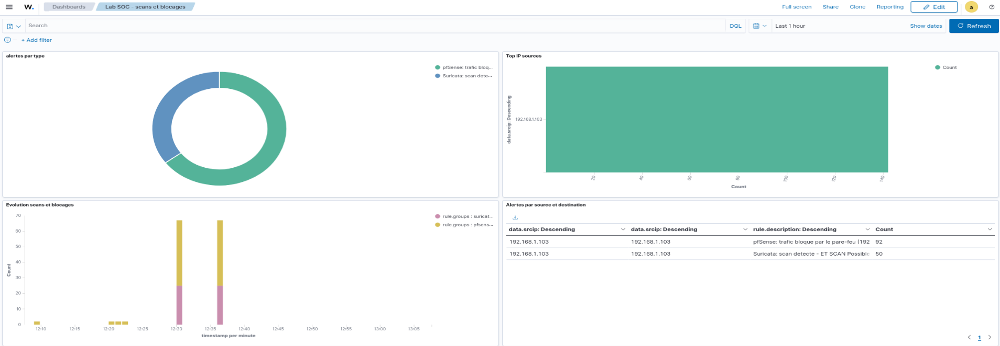

# 🔍 Wazuh SIEM Lab

Lab de centralisation et d'analyse de logs avec Wazuh, intégré à un
environnement pfSense / Suricata déjà segmenté (LAN / DMZ). Les événements
réseau (scans, blocages firewall, alertes IDS) sont corrélés dans un SIEM
unique.

➡️ Ce lab s'appuie sur [`pfsense-suricata-lab`]https://github.com/alexbzz/network-security-lab,
qui détaille la mise en place de pfSense, de la segmentation et de Suricata.

## 🎯 Objectif

Déployer un serveur Wazuh, y connecter des agents et des sources syslog
(pfSense, Suricata), écrire une règle de détection personnalisée, puis
valider la chaîne complète par un scan réel détecté et corrélé.

## 🧰 Technologies

| Outil | Rôle |
|-------|------|
| Wazuh 4.x | SIEM : collecte, corrélation, alertes |
| pfSense | Pare-feu, source de logs (syslog) |
| Suricata | IDS, source d'alertes (eve.json) |
| Debian / Ubuntu | Agent Wazuh, serveur en DMZ |
| Kali Linux | Machine d'attaque / de test |
| VMware Workstation | Virtualisation |

## 🗺️ Architecture

```
            Internet
                |
             pfSense ───────► syslog ───┐
                |                       │
        -----------------               ▼
        |               |         Serveur Wazuh
       LAN             DMZ         (manager + dashboard)
        |               |               ▲
      Kali ◄── agent    Debian ◄── agent │
                (Suricata eve.json) ─────┘
```

| Zone | Réseau | Machine | Rôle |
|------|--------|---------|------|
| LAN | 192.168.1.0/24 | Kali Linux | Attaquant / test, agent Wazuh |
| LAN | 192.168.1.0/24 | Serveur Wazuh | Manager, indexer, dashboard |
| DMZ | 192.168.2.0/24 | Debian Server | Serveur surveillé, agent Wazuh |


## ⚙️ Configuration

### 0. Préparation
Réutilisation de l'infra pfSense existante, ajout d'une VM Wazuh sur le LAN.


### 1. Installation du serveur Wazuh
Installation via le script officiel (`wazuh-install.sh -a`), couvrant le
manager, l'indexer et le dashboard.


### 2. Déploiement des agents
Agent Wazuh installé sur la Debian (DMZ) et sur Kali (LAN), rattachés au
serveur Wazuh.


### 3. Intégration des logs pfSense
Envoi des logs pfSense par syslog (UDP 514) vers le serveur Wazuh.


### 4. Intégration des logs Suricata et des logs applicatifs
Suricata tourne sur pfSense (FreeBSD), sans agent Wazuh possible. Ses alertes
sont transmises par **syslog** (option *Send Alerts to System Log* sur
l'interface Suricata) vers le serveur Wazuh (port 514/UDP), puis décodées par
un **decoder et des règles personnalisés** (`local_decoder.xml`,
`local_rules.xml`) adaptés au format natif de Suricata. En complément, l'agent
Wazuh installé sur le serveur DMZ lit directement les logs Apache
(`access.log`), où une règle Wazuh native détecte déjà les requêtes marquées
par le Nmap Scripting Engine (User-Agent caractéristique), offrant une
deuxième source de détection pour le même trafic.


### 5. Règle de détection personnalisée
Règle locale déclenchée sur un scan détecté par Suricata ou un blocage
pfSense répété (brute force SSH, scan de ports).


### 6. Test de bout en bout
Scan Nmap depuis Kali vers la DMZ : détection par Suricata, blocage par
pfSense, corrélation dans Wazuh.


### 7. Tableau de bord
Dashboard personnalisé regroupant les événements réseau par source, type
et IP d'origine.



## ✅ Tests et résultats

| Test | Attendu | Résultat |
|------|---------|----------|
| Agent Debian actif | Statut *Active* dans Wazuh | ⬜ |
| Agent Kali actif | Statut *Active* dans Wazuh | ⬜ |
| Logs pfSense reçus | Visibles dans Discover | ⬜ |
| Alertes Suricata reçues | Visibles dans Wazuh | ⬜ |
| Règle personnalisée | Se déclenche sur le scan | ⬜ |
| Scan Nmap détecté | Alerte corrélée bout en bout | ⬜ |

## 🧩 Difficultés rencontrées

### 1. `wazuh-logtest` ne décode pas les logs pfSense
- **Symptôme** : `No decoder matched` dès la Phase 2, alors que les logs arrivaient bien.
- **Cause** : pfSense envoie ses logs sans nom de machine (`Oct 9 12:04:40 filterlog[34111]: ...`). Wazuh prenait `filterlog[34111]:` pour le hostname, ne trouvait donc pas de `program_name`, et le décodeur intégré `pf` ne se déclenchait jamais. De plus, `wazuh-logtest` ne retire pas le préfixe de priorité `<134>`, contrairement à une vraie réception syslog.
- **Solution** : coller dans `wazuh-logtest` la ligne telle que Wazuh la reçoit (sans `<134>`), et écrire un décodeur personnalisé qui reconnaît le log par sa structure (champs séparés par des virgules, `block`/`pass`) plutôt que par l'en-tête.

### 2. Règles personnalisées qui ne se déclenchaient pas
- **Symptôme** : seule la règle intégrée 87701 apparaissait, jamais les règles 1001xx.
- **Cause** : mes règles dépendaient d'un décodeur personnalisé qui n'était pas celui utilisé, et testaient un champ `fw_action` qui n'existe pas dans la sortie du décodeur.
- **Solution** : accrocher les règles au bon décodeur et utiliser les champs réellement extraits (visibles en Phase 2 du logtest).

### 3. `wazuh-manager` refusait de démarrer
Trois causes différentes, trouvées avec `grep -iE "error|critical" /var/ossec/logs/ossec.log` :
- **Deux blocs `<group>`** collés dans `local_rules.xml` (reste de l'ancien fichier) : XML invalide.
- **`<field name="action">`** : `action` est un champ « statique » dans Wazuh (comme `srcip`, `dstip`, `protocol`...). Il se teste avec sa propre balise `<action>`. Erreur : `Field 'action' is static`.
- **`<type>pcre2</type>`** dans un décodeur : le moteur de regex se choisit par un attribut, `<regex type="pcre2">`. `xmllint` ne détecte pas ce genre d'erreur, car il ne vérifie que la syntaxe XML, pas les règles de Wazuh.

### 4. `xmllint` signalait une erreur sur le fichier de décodeurs
- **Symptôme** : `Extra content at the end of the document`.
- **Cause** : un fichier de décodeurs contient plusieurs `<decoder>` sans élément racine commun, ce qu'un XML classique n'accepte pas. Ce n'est pas une vraie erreur.
- **Solution** : vérifier en entourant temporairement le fichier d'une racine :
  `(echo "<root>"; sudo cat local_decoder.xml; echo "</root>") | xmllint --noout -`

### 5. Impossible de joindre la DMZ depuis Kali
- **Symptôme** : ni ping ni HTTP vers `192.168.2.10`, alors que les règles pfSense étaient correctes et qu'aucune ligne de blocage n'apparaissait dans les logs.
- **Cause** : `ip route get 192.168.2.10` renvoyait `dev kali table 51820`. Un VPN WireGuard actif sur Kali captait tout le trafic, y compris celui destiné au lab. Les paquets n'atteignaient jamais pfSense.
- **Solution** : désactiver le VPN pendant le lab (ou ajouter une route statique plus précise `192.168.2.0/24 via 192.168.1.1`). Le traceroute montre ensuite le passage par pfSense.

### 6. Logs Suricata non décodés dans `wazuh-logtest`
- **Symptôme** : `No decoder matched`, avec une Phase 1 vide.
- **Cause** : la ligne de test était incomplète (sans date ni hostname), donc Wazuh ne voyait pas `program_name = suricata`.
- **Solution** : tester avec une ligne complète copiée depuis les vrais logs (`/var/log/syslog` ou `journalctl`).

### Limite connue
L'agent Wazuh de la Debian DMZ tente de joindre le serveur Wazuh sur le port 1514, mais la règle pfSense « block DMZ to LAN » l'en empêche. Une règle `Pass` TCP 1514 de `192.168.2.10` vers le serveur Wazuh, placée avant le blocage, serait nécessaire pour une remontée de logs

## 📚 Ce que j'ai appris

- Architecture d'un SIEM : manager, indexer, dashboard
- Intégration de sources hétérogènes (syslog, fichiers JSON, agents)
- Écriture de règles et décodeurs Wazuh personnalisés
- Corrélation d'événements entre pare-feu, IDS et SIEM

## 🚀 Pistes d'amélioration

- Alerting externe (email, Slack, webhook) sur les règles critiques
- Intégration d'un flux de threat intelligence (listes d'IP malveillantes)
- Durcissement du serveur Wazuh (TLS, authentification renforcée)
- Ajout d'agents Windows pour couvrir un parc hétérogène
- Tableaux de bord MITRE ATT&CK

## 📁 Structure du dépôt

```
.
├── README.md
├── screenshots/
```

## ⚠️ Avertissement

Ce lab est réalisé à des fins pédagogiques, dans un environnement isolé.
