# 🔍 Wazuh SIEM Lab

Lab de centralisation et d'analyse de logs avec Wazuh, intégré à un
environnement pfSense / Suricata déjà segmenté (LAN / DMZ). Les événements
réseau (scans, blocages firewall, alertes IDS) sont corrélés dans un SIEM
unique.

➡️ Ce lab s'appuie sur [`pfsense-suricata-lab`]https://github.com/alexbzz/network-security-lab,
qui détaille la mise en place de pfSense, de la segmentation et de Suricata.

## 🎯 Objectif

Déployer un serveur Wazuh, y connecter des agents et des sources syslog
(pfSense, Suricata), écrire une règle de détection personnalisée, puis
valider la chaîne complète par un scan réel détecté et corrélé.

## 🧰 Technologies

| Outil | Rôle |
|-------|------|
| Wazuh 4.x | SIEM : collecte, corrélation, alertes |
| pfSense | Pare-feu, source de logs (syslog) |
| Suricata | IDS, source d'alertes (eve.json) |
| Debian / Ubuntu | Agent Wazuh, serveur en DMZ |
| Kali Linux | Machine d'attaque / de test |
| VMware Workstation | Virtualisation |

## 🗺️ Architecture

```
            Internet
                |
             pfSense ───────► syslog ───┐
                |                       │
        -----------------               ▼
        |               |         Serveur Wazuh
       LAN             DMZ         (manager + dashboard)
        |               |               ▲
      Kali ◄── agent    Debian ◄── agent │
                (Suricata eve.json) ─────┘
```

| Zone | Réseau | Machine | Rôle |
|------|--------|---------|------|
| LAN | 192.168.1.0/24 | Kali Linux | Attaquant / test, agent Wazuh |
| LAN | 192.168.1.0/24 | Serveur Wazuh | Manager, indexer, dashboard |
| DMZ | 192.168.2.0/24 | Debian Server | Serveur surveillé, agent Wazuh |

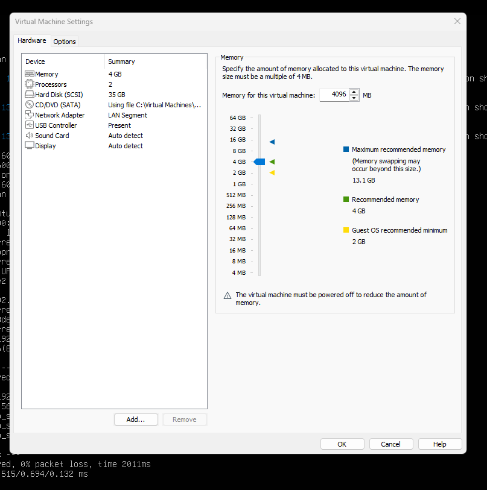

## ⚙️ Configuration

### 0. Préparation
Réutilisation de l'infra pfSense existante, ajout d'une VM Wazuh sur le LAN.


### 1. Installation du serveur Wazuh
Installation via le script officiel (`wazuh-install.sh -a`), couvrant le
manager, l'indexer et le dashboard.


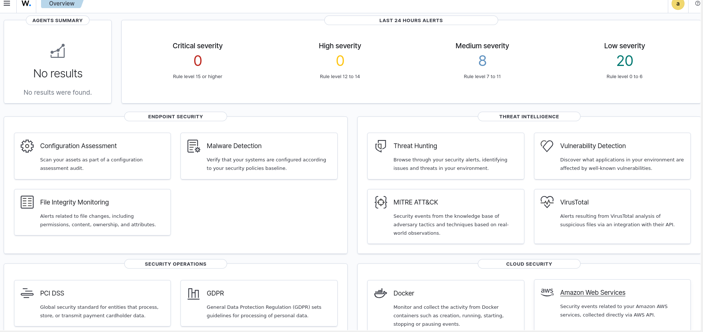

### 2. Déploiement des agents
Agent Wazuh installé sur la Debian (DMZ) et sur Kali (LAN), rattachés au
serveur Wazuh.

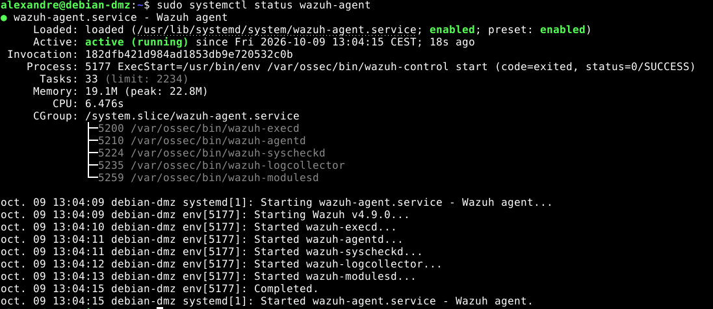
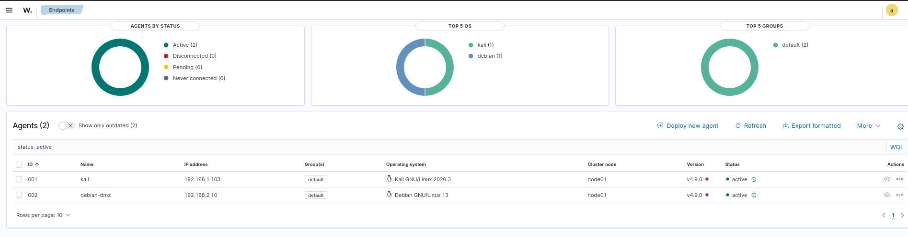

### 3. Intégration des logs pfSense
Envoi des logs pfSense par syslog (UDP 514) vers le serveur Wazuh.

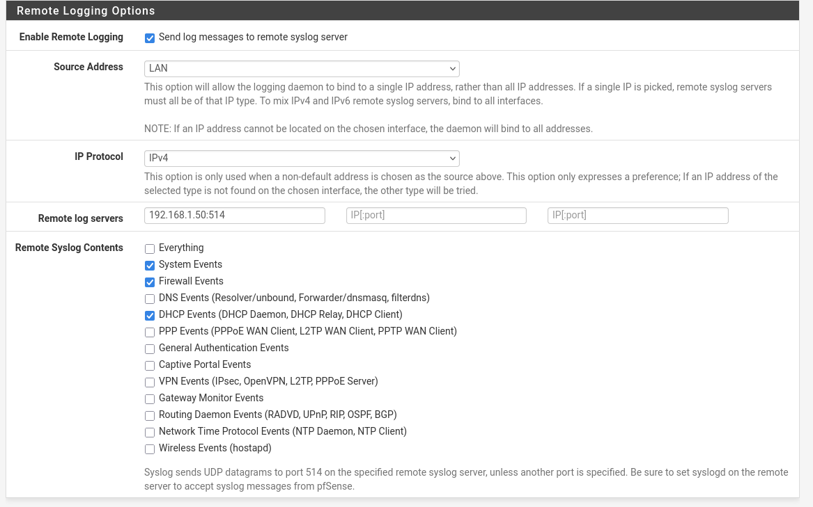
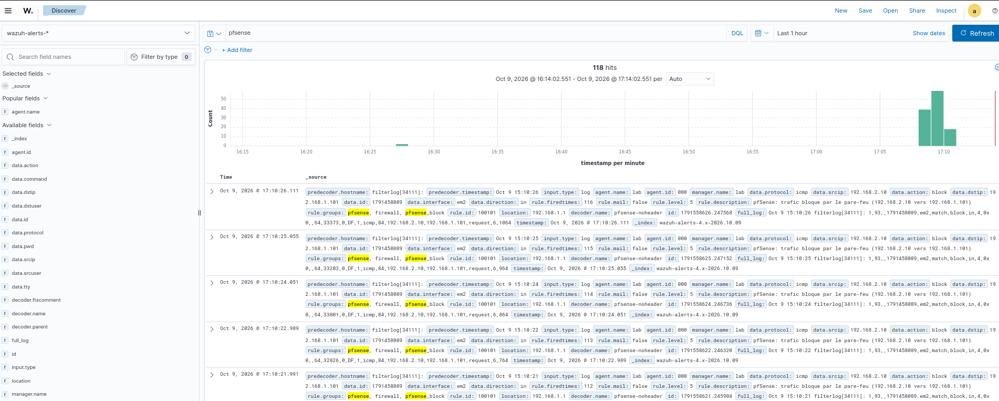

### 4. Intégration des logs Suricata et des logs applicatifs
Suricata tourne sur pfSense (FreeBSD), sans agent Wazuh possible. Ses alertes
sont transmises par **syslog** (option *Send Alerts to System Log* sur
l'interface Suricata) vers le serveur Wazuh (port 514/UDP), puis décodées par
un **decoder et des règles personnalisés** (`local_decoder.xml`,
`local_rules.xml`) adaptés au format natif de Suricata. En complément, l'agent
Wazuh installé sur le serveur DMZ lit directement les logs Apache
(`access.log`), où une règle Wazuh native détecte déjà les requêtes marquées
par le Nmap Scripting Engine (User-Agent caractéristique), offrant une
deuxième source de détection pour le même trafic.

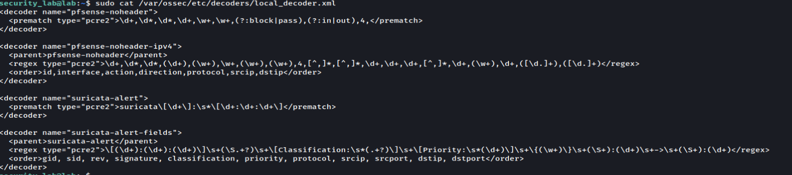
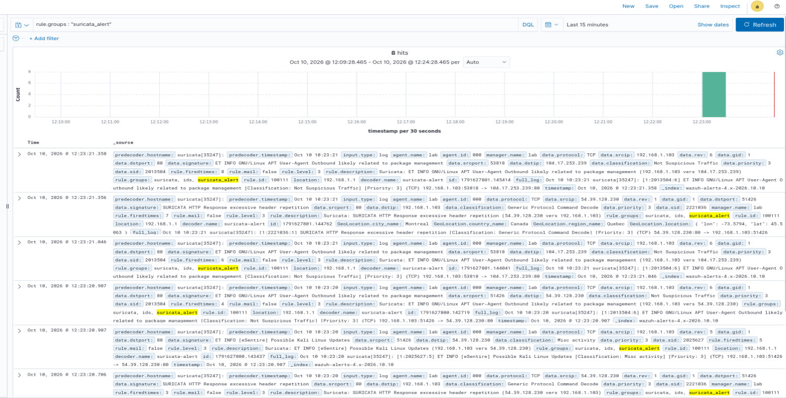
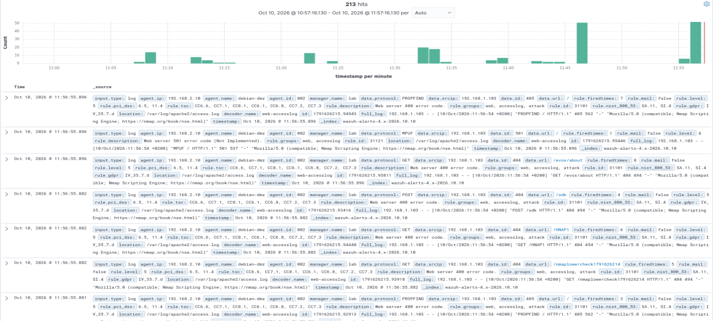

### 5. Règle de détection personnalisée
Règle locale déclenchée sur un scan détecté par Suricata ou un blocage
pfSense répété (brute force SSH, scan de ports).

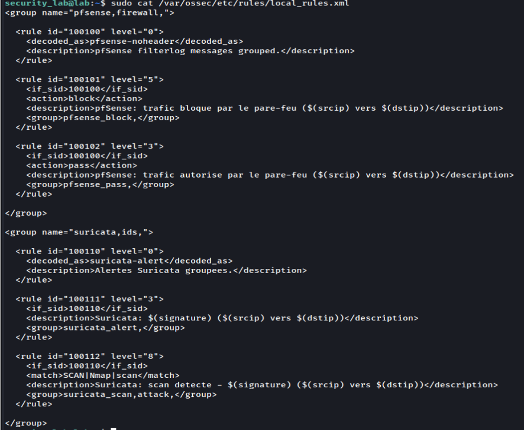
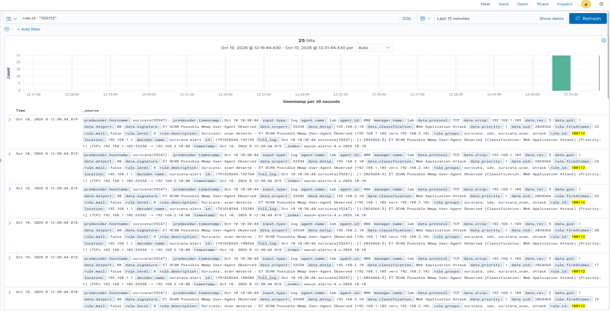

### 6. Test de bout en bout
Scan Nmap depuis Kali vers la DMZ : détection par Suricata, blocage par
pfSense, corrélation dans Wazuh.

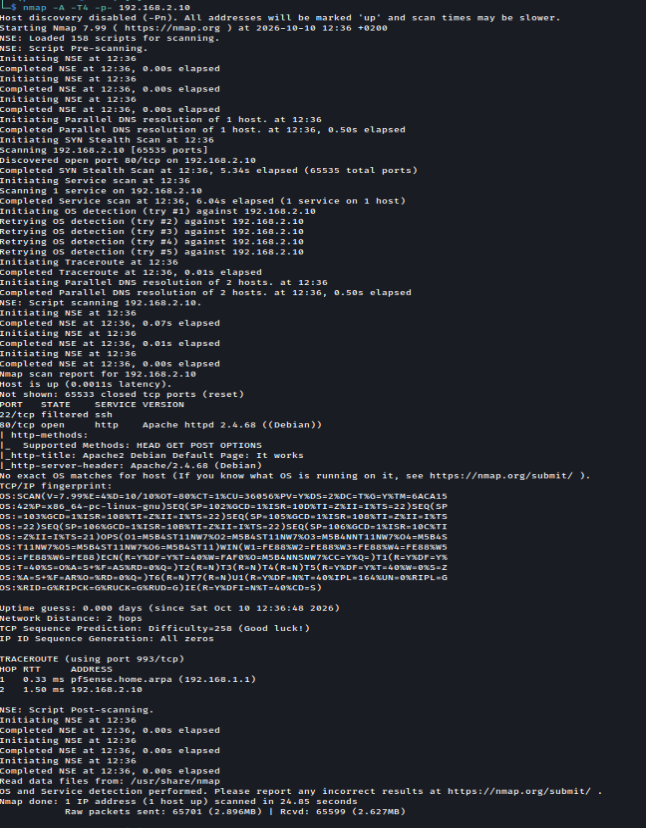
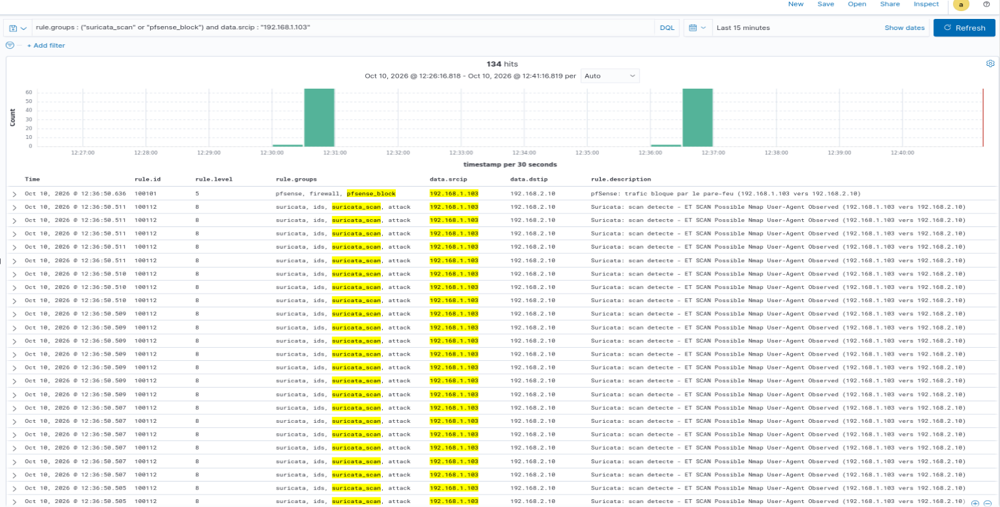

### 7. Tableau de bord
Dashboard personnalisé regroupant les événements réseau par source, type
et IP d'origine.


## ✅ Tests et résultats

| Test | Attendu | Résultat |
|------|---------|----------|
| Agent Debian actif | Statut *Active* dans Wazuh | ⬜ |
| Agent Kali actif | Statut *Active* dans Wazuh | ⬜ |
| Logs pfSense reçus | Visibles dans Discover | ⬜ |
| Alertes Suricata reçues | Visibles dans Wazuh | ⬜ |
| Règle personnalisée | Se déclenche sur le scan | ⬜ |
| Scan Nmap détecté | Alerte corrélée bout en bout | ⬜ |

## 🧩 Difficultés rencontrées

*(à compléter au fil du lab)*

## 📚 Ce que j'ai appris

- Architecture d'un SIEM : manager, indexer, dashboard
- Intégration de sources hétérogènes (syslog, fichiers JSON, agents)
- Écriture de règles et décodeurs Wazuh personnalisés
- Corrélation d'événements entre pare-feu, IDS et SIEM

## 🚀 Pistes d'amélioration

- Alerting externe (email, Slack, webhook) sur les règles critiques
- Intégration d'un flux de threat intelligence (listes d'IP malveillantes)
- Durcissement du serveur Wazuh (TLS, authentification renforcée)
- Ajout d'agents Windows pour couvrir un parc hétérogène
- Tableaux de bord MITRE ATT&CK

## 📁 Structure du dépôt

```
.
├── README.md
├── screenshots/
```

## ⚠️ Avertissement

Ce lab est réalisé à des fins pédagogiques, dans un environnement isolé.
